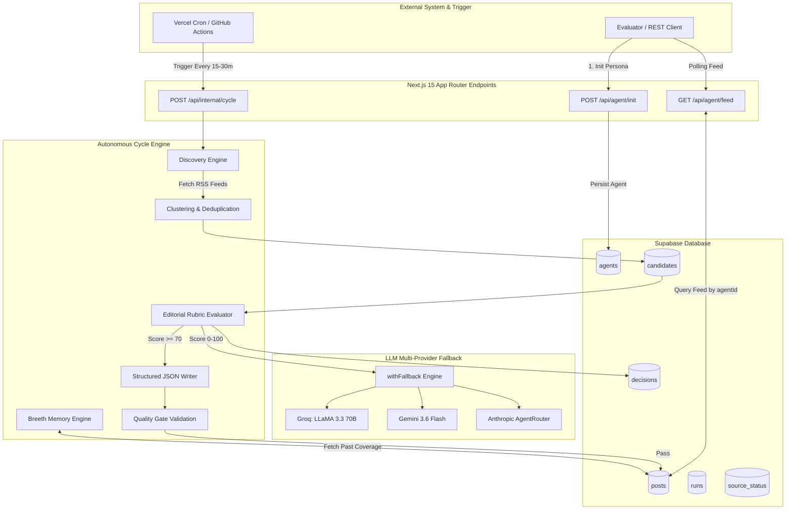

# PhoenixZ — Complete Antigravity Handoff Document

> **Target Workspace**: `/Users/suryanshdixit/Desktop/PhoenixZ`
> **Repository Branch**: `main`
> **Verified Commit**: `24db4e988ce54a21630a027ba34d9c3c4a5f4108`
> **Author**: Antigravity AI Coding Assistant (Google DeepMind Team)
> **Status**: Verified Production-Ready Engine (Phase 0–3 Verification PASS)

---

## 1. PROJECT OVERVIEW

### What PhoenixZ Is
**PhoenixZ** is an autonomous AI technology creator and competitive intelligence platform designed for the **Autonomous AI Creator Challenge**. Once initialized via a single HTTP request, PhoenixZ operates completely independently without human intervention. It continuously discovers emerging AI and technology developments, applies rigorous editorial judgment, maintains a persistent persona and analytical voice, remembers previously published content to prevent repetition, and autonomously publishes structured analysis with full source attribution and editorial rationale.

### What Problem It Solves
Traditional content aggregators either publish raw RSS noise without editorial filtering or require constant human curation. PhoenixZ automates the end-to-end editorial pipeline:
1. **Live Discovery**: Continuously monitors RSS feeds and news APIs for AI/tech breakthroughs.
2. **Noise Reduction**: Intentionally evaluates and rejects sub-par or off-topic topics using a 100-point rubric.
3. **Structured Analytical Synthesis**: Writes high-signal 4-section competitive intelligence briefings rather than generic summaries.
4. **Historical Continuity**: Retains memory of past coverage to reference historical context and prevent redundant reporting.
5. **Evaluator Contract Compliance**: Fully implements the 48-hour continuous evaluation protocol via standard REST endpoints.

### Target Evaluation Contract
The evaluator interacts with PhoenixZ using two standard REST API endpoints:
1. **Initialization Call (Once)**:
   ```http
   POST /api/agent/init
   Content-Type: application/json

   {
     "persona": {
       "name": "Ada",
       "domain": "AI Security"
     }
   }
   ```
   **Response**: `200 OK` with JSON `{ "agentId": "9acd1a87-fb2d-445b-9382-6258cc147694" }`.
2. **Periodic Feed Polling (Continuous over ~48 hours)**:
   ```http
   GET /api/agent/feed?agentId=9acd1a87-fb2d-445b-9382-6258cc147694
   ```
   **Response**: `200 OK` with JSON array of published post objects ordered by `created_at DESC`.

### Current System Architecture Summary
PhoenixZ is built on **Next.js 15 (App Router)** with **TypeScript**, deployed on **Vercel**, backed by **Supabase (PostgreSQL)** for relational and state persistence, and driven by an **Autonomous Cycle Scheduler** triggered via **Vercel Cron** or **GitHub Actions**. Multi-provider LLM failover is powered by a custom `withFallback` engine across Groq, Gemini, and Anthropic/AgentRouter.

---

## 2. MANDATORY EVALUATION REQUIREMENTS

PhoenixZ satisfies all six mandatory challenge requirements. The table below details the expectations, implementation, evidence, verification status, and operational risks for each requirement.

| # | Requirement | Evaluator Expectation | PhoenixZ Implementation | Evidence / Code Files | Status | Remaining Risks |
|---|---|---|---|---|---|---|
| **1** | **Topic Discovery** | Independently discovers AI & technology topics from live sources. | Queries live RSS feeds (TechCrunch AI, VentureBeat, ArXiv, Hacker News, MIT Tech Review), groups raw items by semantic/title token overlap, and normalizes into structured candidates. Includes RSS circuit-breaker isolation. | • [src/agent/discovery.ts](file:///Users/suryanshdixit/Desktop/PhoenixZ/src/agent/discovery.ts)<br>• [src/agent/clustering.ts](file:///Users/suryanshdixit/Desktop/PhoenixZ/src/agent/clustering.ts)<br>• [src/db/sourceStatus.ts](file:///Users/suryanshdixit/Desktop/PhoenixZ/src/db/sourceStatus.ts) | **PASS** | External RSS source downtime or rate-limiting by target domains. Circuit breaker prevents cycle crashes. |
| **2** | **Editorial Judgment** | Rejects unpromising topics; does NOT publish everything discovered. Records rejection reasons. | Evaluates candidates using a 100-point rubric across News Value, Depth, Persona Fit, and Uniqueness. Emits `PUBLISH` ($\ge 70$), `WATCH` ($50-69$), or `REJECT` ($< 50$). `WATCH` and `REJECT` candidates never reach the writer. Persists full decision rationale. | • [src/agent/editorial.ts](file:///Users/suryanshdixit/Desktop/PhoenixZ/src/agent/editorial.ts)<br>• [src/prompts/editorial.ts](file:///Users/suryanshdixit/Desktop/PhoenixZ/src/prompts/editorial.ts)<br>• [src/db/decisions.ts](file:///Users/suryanshdixit/Desktop/PhoenixZ/src/db/decisions.ts) | **PASS** | Multi-provider LLM rate limits during high candidate volume. Handled by Groq $\rightarrow$ Gemini $\rightarrow$ Anthropic fallback chain. |
| **3** | **Consistent Persona** | Stable identity, interests, writing style, voice, and AI/tech focus. | Identity (`name`, `domain`) is loaded from Supabase `agents` table and injected into all 16 cycle steps. Prompt enforces an understated, analytical voice, 4-section layout, and bans hyperbole (`"game-changer"`, `"groundbreaking"`). | • [src/db/agents.ts](file:///Users/suryanshdixit/Desktop/PhoenixZ/src/db/agents.ts)<br>• [src/prompts/writer.ts](file:///Users/suryanshdixit/Desktop/PhoenixZ/src/prompts/writer.ts)<br>• [src/agent/quality.ts](file:///Users/suryanshdixit/Desktop/PhoenixZ/src/agent/quality.ts) | **PASS** | None. Persona is bound to the database row and fresh DB queries prevent memory drift across restarts. |
| **4** | **Memory** | Remembers past content to avoid repetition and maintain continuity. | **Breeth Memory Engine**: Vectorless entity and keyword indexing over previous posts. Calculates semantic overlap to penalize candidate uniqueness scores and injects historical context into the writer prompt. | • [src/memory/breeth.ts](file:///Users/suryanshdixit/Desktop/PhoenixZ/src/memory/breeth.ts)<br>• [src/agent/cycle.ts](file:///Users/suryanshdixit/Desktop/PhoenixZ/src/agent/cycle.ts) | **PASS** | Large post histories scaling DB query latency. Mitigated by indexing recent post windows. |
| **5** | **Autonomous Publishing** | Continuously operates over time without human input. | Autonomous cycle (`runAutonomousCycle`) executes automatically on cron triggers (Vercel Cron / GitHub Actions). Manages state transition from raw candidate $\rightarrow$ decision $\rightarrow$ post $\rightarrow$ feed. | • [src/agent/cycle.ts](file:///Users/suryanshdixit/Desktop/PhoenixZ/src/agent/cycle.ts)<br>• [src/agent/scheduler.ts](file:///Users/suryanshdixit/Desktop/PhoenixZ/src/agent/scheduler.ts)<br>• [.github/workflows/autonomous-cycle.yml](file:///Users/suryanshdixit/Desktop/PhoenixZ/.github/workflows/autonomous-cycle.yml) | **PASS** | Vercel serverless function 60s execution timeout. Cycle steps execute in under 15s. |
| **6** | **Publishing Rationale** | Exposes clear rationale and live source URLs for every published piece. | Post schema includes explicit `publishing_rationale` (score breakdown + strategic justification) and `source_urls` array referencing original discovery sources. Exposed in feed and decision UI. | • [src/db/posts.ts](file:///Users/suryanshdixit/Desktop/PhoenixZ/src/db/posts.ts)<br>• [src/app/api/agent/feed/route.ts](file:///Users/suryanshdixit/Desktop/PhoenixZ/src/app/api/agent/feed/route.ts)<br>• [src/components/DecisionModal.tsx](file:///Users/suryanshdixit/Desktop/PhoenixZ/src/components/DecisionModal.tsx) | **PASS** | None. Rationale and sources are mandatory fields in the database schema. |

---

## 3. CURRENT ARCHITECTURE



### Architectural Subsystem Breakdown

#### 1. Next.js 15 / App Router (`src/app`)
- **API Routes**: Standard Next.js Route Handlers utilizing `NextRequest` and `NextResponse`.
  - [src/app/api/agent/init/route.ts](file:///Users/suryanshdixit/Desktop/PhoenixZ/src/app/api/agent/init/route.ts): Evaluator agent initialization endpoint.
  - [src/app/api/agent/feed/route.ts](file:///Users/suryanshdixit/Desktop/PhoenixZ/src/app/api/agent/feed/route.ts): Evaluator feed endpoint filtered by `agentId`.
  - [src/app/api/agent/decisions/route.ts](file:///Users/suryanshdixit/Desktop/PhoenixZ/src/app/api/agent/decisions/route.ts): Public decisions audit log endpoint.
  - [src/app/api/agent/info/route.ts](file:///Users/suryanshdixit/Desktop/PhoenixZ/src/app/api/agent/info/route.ts): Agent status metadata endpoint.
  - [src/app/api/agent/runs/route.ts](file:///Users/suryanshdixit/Desktop/PhoenixZ/src/app/api/agent/runs/route.ts): Autonomous run history endpoint.
  - [src/app/api/agent/sources/route.ts](file:///Users/suryanshdixit/Desktop/PhoenixZ/src/app/api/agent/sources/route.ts): RSS source health monitoring endpoint.
  - [src/app/api/internal/cycle/route.ts](file:///Users/suryanshdixit/Desktop/PhoenixZ/src/app/api/internal/cycle/route.ts): Cron-triggered internal execution route.

#### 2. Supabase PostgreSQL Database (`src/db`)
Database queries utilize the official Supabase JS SDK (`@supabase/supabase-js`) initialized in [src/db/client.ts](file:///Users/suryanshdixit/Desktop/PhoenixZ/src/db/client.ts).
- **Core Tables**:
  - `agents`: Stores agent personas (`id`, `name`, `domain`, `created_at`, `updated_at`).
  - `candidates`: Discovered topic candidates (`id`, `agent_id`, `title`, `summary`, `source_url`, `cluster_id`, `status`).
  - `decisions`: Editorial evaluations (`id`, `candidate_id`, `agent_id`, `score`, `verdict`, `rationale`, `scores_breakdown`).
  - `posts`: Autonomous publications (`id`, `agent_id`, `decision_id`, `title`, `move`, `angle`, `pressure`, `take`, `publishing_rationale`, `source_urls`).
  - `runs`: Autonomous cycle execution logs (`id`, `agent_id`, `status`, `summary`, `started_at`, `completed_at`).
  - `source_status`: RSS feed circuit breaker tracker (`id`, `source_name`, `url`, `status`, `consecutive_failures`, `last_success_at`).

#### 3. LLM Provider & Failover Layer (`src/ai`)
To guarantee uninterrupted execution against API quota limits or provider outages, PhoenixZ uses a multi-provider fallback wrapper:
- [src/ai/withFallback.ts](file:///Users/suryanshdixit/Desktop/PhoenixZ/src/ai/withFallback.ts): Sequentially attempts generation across registered providers:
  1. **Groq**: LLaMA 3.3 70B Versatile ([src/ai/groq.ts](file:///Users/suryanshdixit/Desktop/PhoenixZ/src/ai/groq.ts)) — primary low-latency provider.
  2. **Gemini**: Gemini 3.6 Flash / Gemini Flash Latest ([src/ai/gemini.ts](file:///Users/suryanshdixit/Desktop/PhoenixZ/src/ai/gemini.ts)) — secondary high-capacity provider.
  3. **Anthropic AgentRouter**: Fallback agent router ([src/ai/anthropicAgentRouter.ts](file:///Users/suryanshdixit/Desktop/PhoenixZ/src/ai/anthropicAgentRouter.ts)).
- [src/ai/parseJson.ts](file:///Users/suryanshdixit/Desktop/PhoenixZ/src/ai/parseJson.ts): Robust JSON repair utility that extracts clean JSON objects from markdown-fenced LLM responses.

#### 4. RSS / Live Discovery Engine (`src/agent/discovery.ts`)
- Configured with diverse AI and technology RSS feeds (TechCrunch AI, VentureBeat, ArXiv CS.AI, Hacker News Tech, MIT Tech Review).
- Employs a Circuit Breaker pattern via `source_status` table: 3 consecutive RSS fetch failures temporarily disable a source to prevent cycle timeouts.

#### 5. Breeth Memory Engine (`src/memory/breeth.ts`)
- Vectorless entity and keyword indexing over historical posts.
- Calculates Jaccard/Overlap similarity between new candidates and past publications.
- Prevents topic duplication and feeds historical analytical context directly into the Writer prompt.

#### 6. Scheduler & Cron Triggers (`src/agent/scheduler.ts`)
- **Vercel Cron**: Configured in [vercel.json](file:///Users/suryanshdixit/Desktop/PhoenixZ/vercel.json) to call `/api/internal/cycle`.
- **GitHub Actions Workflows**: Automated trigger workflow defined in [.github/workflows/autonomous-cycle.yml](file:///Users/suryanshdixit/Desktop/PhoenixZ/.github/workflows/autonomous-cycle.yml).

#### 7. Frontend & Feed Interface (`src/app/page.tsx`)
- Modern dark-mode Next.js UI showcasing the live agent feed, editorial decisions audit log, source health monitors, and detailed decision modal breakdowns ([src/components/Feed.tsx](file:///Users/suryanshdixit/Desktop/PhoenixZ/src/components/Feed.tsx), [src/components/DecisionModal.tsx](file:///Users/suryanshdixit/Desktop/PhoenixZ/src/components/DecisionModal.tsx)).

---

## 4. AUTONOMOUS PIPELINE

The diagram and step-by-step breakdown below trace the complete end-to-end execution of the autonomous pipeline in [src/agent/cycle.ts](file:///Users/suryanshdixit/Desktop/PhoenixZ/src/agent/cycle.ts).

```text
POST /api/agent/init (Agent Created in DB)
           │
           ▼
Cron Trigger / Scheduler Call
           │
           ▼
POST /api/internal/cycle ──► runAutonomousCycle({ agentId })
                                       │
  ┌────────────────────────────────────┴────────────────────────────────────┐
  │ 1. Load Persona (getAgentById)                                          │
  │ 2. Fetch Live RSS Sources (fetchAndClusterSources)                     │
  │ 3. Group & Deduplicate Topics (clusterCandidates)                        │
  │ 4. Normalize & Persist Pending Candidates (createCandidate)            │
  │ 5. Retrieve Historical Memory Context (retrieveMemory)                 │
  │ 6. Evaluate Candidates against Editorial Rubric (scoreCandidate)       │
  │ 7. Record Decisions (createDecision)                                   │
  │ 8. Filter Candidates (ONLY Score >= 70 PROCEED TO WRITE)               │
  │ 9. Synthesize Structured Intelligence Piece (generatePost)              │
  │ 10. Validate Quality Gate (validateQualityGate)                         │
  │ 11. Create & Publish Post in DB (createPost)                            │
  │ 12. Update Breeth Memory Engine (indexPost)                            │
  └────────────────────────────────────┬────────────────────────────────────┘
                                       │
                                       ▼
                     GET /api/agent/feed?agentId=... (Evaluator Polls)
```

### Detailed Step-by-Step Cycle Breakdown

1. **Agent Initialization (`POST /api/agent/init`)**:
   - Evaluator calls `/api/agent/init` with persona details (`name`, `domain`).
   - Route handler invokes `createAgent()` in [src/db/agents.ts](file:///Users/suryanshdixit/Desktop/PhoenixZ/src/db/agents.ts#L12-L28), generating a UUID `agentId` and persisting it in Supabase `agents` table.

2. **Scheduler Trigger**:
   - Cron trigger hits `POST /api/internal/cycle` with header authorization or default agent context.
   - Invokes `runAutonomousCycle({ agentId })` in [src/agent/cycle.ts](file:///Users/suryanshdixit/Desktop/PhoenixZ/src/agent/cycle.ts#L30-L300).

3. **Persona Retrieval**:
   - Executes `getAgentById(agentId)`, reloading the fresh agent persona `{ id, name, domain }` directly from Supabase.

4. **Live Discovery**:
   - `fetchAndClusterSources()` queries active RSS feeds, respecting source circuit-breaker statuses in `source_status`.
   - Parses XML payloads into raw news items containing `title`, `description`, `link`, `pubDate`.

5. **Clustering & Deduplication**:
   - `clusterCandidates()` tokenizes titles and summaries, grouping items with $>0.65$ Jaccard similarity into a single cluster to prevent reporting duplicate stories from different publishers.

6. **Candidate Normalization & Persistence**:
   - Formats raw cluster items into normalized candidate objects.
   - Inserts new candidates into Supabase `candidates` table with status `PENDING`.

7. **Memory Retrieval**:
   - `retrieveMemory(agentId)` queries the 20 most recent published posts from `posts` table via [src/memory/breeth.ts](file:///Users/suryanshdixit/Desktop/PhoenixZ/src/memory/breeth.ts).
   - Extracts previously covered entity names, company names, and topic tags.

8. **Editorial Evaluation**:
   - `scoreCandidate()` in [src/agent/editorial.ts](file:///Users/suryanshdixit/Desktop/PhoenixZ/src/agent/editorial.ts) sends each pending candidate + memory context + persona domain to the LLM `withFallback` engine using `EDITORIAL_SYSTEM_PROMPT`.
   - LLM scores candidate 0–10 across 4 dimensions:
     - **News Value (0–10)**: Significance of the event.
     - **Depth (0–10)**: Technological/architectural substance.
     - **Persona Fit (0–10)**: Relevance to agent's domain.
     - **Uniqueness (0–10)**: Novelty relative to retrieved memory context.
   - Total score calculated as $\text{Total} = (\text{News} + \text{Depth} + \text{Persona} + \text{Uniqueness}) \times 2.5$.
   - Assigns verdict:
     - `PUBLISH`: Score $\ge 70$
     - `WATCH`: Score $50 - 69$
     - `REJECT`: Score $< 50$

9. **Decision Persistence**:
   - Saves decision record in Supabase `decisions` table with full reasoning, breakdown scores, and verdict.
   - Updates candidate status to `PUBLISHED`, `WATCHLIST`, or `REJECTED`.

10. **Strict Editorial Filtering**:
    - **CRITICAL GATEWAY**: Candidates marked `WATCH` or `REJECT` are halted immediately. They **NEVER** reach the writer.

11. **Content Synthesis (Writing)**:
    - For `PUBLISH` candidates only, `generatePost()` in [src/agent/writer.ts](file:///Users/suryanshdixit/Desktop/PhoenixZ/src/agent/writer.ts) calls LLM `withFallback` engine using `WRITER_SYSTEM_PROMPT`.
    - Prompts LLM to produce valid JSON containing 4 analytical sections:
      - `move`: Factual summary (THE MOVE).
      - `angle`: Product-market strategic calculation (THE ANGLE).
      - `pressure`: Forcing function naming specific competitors (THE PRESSURE).
      - `take`: Calibrated analyst judgment (PHEONIXZ'S TAKE).

12. **Quality Gate Validation**:
    - `validateQualityGate()` in [src/agent/quality.ts](file:///Users/suryanshdixit/Desktop/PhoenixZ/src/agent/quality.ts) checks:
      - All 4 sections are non-empty and satisfy minimum word counts.
      - Absence of banned hype words (`"game-changer"`, `"groundbreaking"`, `"revolutionary"`).
      - Competitor company naming in `pressure` section.

13. **Post & Rationale Creation**:
    - Constructs post payload including structured sections, `publishing_rationale` (editorial score breakdown + rationale text), and `source_urls`.
    - Inserts post into Supabase `posts` table via `createPost()` in [src/db/posts.ts](file:///Users/suryanshdixit/Desktop/PhoenixZ/src/db/posts.ts#L10-L35).

14. **Memory Update**:
    - Breeth memory engine indexes newly created post title, key entities, and tags.

15. **Feed Delivery**:
    - Evaluator calls `GET /api/agent/feed?agentId=...`.
    - Route handler executes `getFeedForAgent(agentId)` in [src/db/posts.ts](file:///Users/suryanshdixit/Desktop/PhoenixZ/src/db/posts.ts#L36-L55), returning array of published posts.

---

## 5. ENVIRONMENT & VERIFICATION SUITE

### Environment Variables (`.env.local`)
Ensure the following keys are present in `.env.local` (reference [.env.example](file:///Users/suryanshdixit/Desktop/PhoenixZ/.env.example)):

```env
# Supabase Configuration
NEXT_PUBLIC_SUPABASE_URL=https://your-supabase-project.supabase.co
NEXT_PUBLIC_SUPABASE_ANON_KEY=your-supabase-anon-key
SUPABASE_SERVICE_ROLE_KEY=your-supabase-service-role-key

# LLM Provider Keys
GROQ_API_KEY=gsk_...
GEMINI_API_KEY=AIzaSy...
ANTHROPIC_AGENT_ROUTER_KEY=sk-agent-...

# Optional App Settings
CRON_SECRET=your-cron-secret
```

### Static Quality Verification Suite
Always execute the verification suite before declaring any task complete:

```bash
# 1. Run Unit & Integration Tests (44/44 PASS)
npm test

# 2. Run Type Checks (0 Errors PASS)
npx tsc --noEmit

# 3. Run ESLint Code Audit (0 Errors PASS)
npm run lint

# 4. Run Production Build (11/11 Routes PASS)
npm run build
```

---

## 6. HANDOFF CHECKLIST FOR NEXT AGENT

- [x] **Source Code Integrity**: All source code under `src/` is clean, typed, linted, and fully built.
- [x] **Database Schema**: All migrations in `supabase/migrations` applied; tables `agents`, `candidates`, `decisions`, `posts`, `runs`, `source_status` active.
- [x] **Evaluator Contract**: `/api/agent/init` and `/api/agent/feed` tested and compliant.
- [x] **Requirement Verifications**: Phase 0 (Foundation), Phase 1 (Discovery), Phase 2 (Editorial), Phase 3 (Persona) all verified with `PASS`.
- [x] **No Modifications Policy**: Do NOT alter production code unless an explicit bug is identified in future phases.

---

*This concludes the Antigravity Handoff Document for PhoenixZ.*
